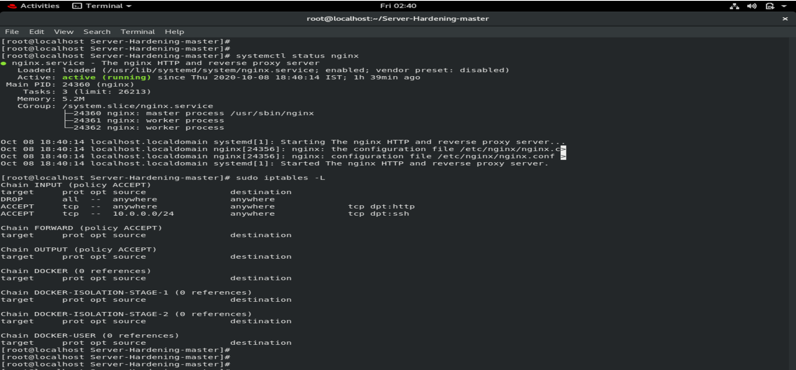
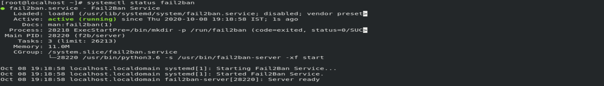

## Table of Contents

* [About the Project](#about-the-project)
  * [Built With](#built-with)
* [Getting Started](#getting-started)
  * [Prerequisites](#prerequisites)
  * [Installation](#installation)
* [Usage](#usage)
* [Proofs](#proofs)
* [Contributing](#contributing)
* [License](#license)
* [Contact](#contact)
* [Acknowledgements](#acknowledgements)


## About The Project

This is a Repository containing Server Hardening techniques which have been implemented using Ansible Roles.

I have created ansible roles for the following tasks
- accounts : this installs and configures fail2ban which helps in intrusion detection and system administrators can check illegal activities from logs
Also I have created a user ansible which is part of group power which I have given sudo powers

- network : Here we make ssh more secure by only allowing key based login , adding protocol 2 and limiting the number of tries , preventing TcpForwarding and etc
I have also added firewall rules to allow ssh access only from a particular network and only allow webserver access requests and removed all other rules

- physical : This provides security against single user mode and only allows login using password in the grub and also provides security against all types of physical attacks
Also changes grub settings .

-  luks-conf : make a harddisk encrypted for users and users will be able to store data securely and can decrypt it anytime using passphrase

The repository contains ansible vaults
Along with that it contains a role for setting up and configuring docker and kubernetes in remote systems , the role name is kubernetes-docker


### Built With

* [Ansible](https://docs.ansible.com/)
* [AWS](https://docs.aws.amazon.com/)
* [Docker](https://docs.docker.com/)
* [Kubernetes](https://kubernetes.io/docs/home/)


## Getting Started

This is an example of how you may give instructions on setting up your project locally.
To get a local copy up and running follow these simple example steps.


### Prerequisites

* pip
* AWS ec2 instance


### Installation

1. Install and configure yum, vim and git

2. Clone the repo
```sh
git clone https://github.com/ShirshaDatta/Server-Hardening
```

3. Ping to localhost
```sh
ping localhost
```

4. Install Ansible (If python3 not installed, do it and then install ansible )
```sh
pip3 install ansible
or 
yum install ansible
```
## Usage

Check if ansible is installed successfully.


Setup Firewall Rules


Create Super User and setup fail2ban


## Proofs

We saw that the playbook is successfully run. Now we will cross-check the same manually.

Checking if nginx is installed and  the service started and firewall rules


Checking if fail-to-ban is installed and running


## Contributing

Contributions are what make the open source community such an amazing place to be learn, inspire, and create. Any contributions you make are **greatly appreciated**.

1. Fork the Project
2. Create your Feature Branch (`git checkout -b feature/AmazingFeature`)
3. Commit your Changes (`git commit -m 'Added some AmazingFeature'`)
4. Push to the Branch (`git push origin feature/AmazingFeature`)
5. Open a Pull Request


## License

Distributed under the MIT License. See `LICENSE` for more information.


## Contact

- Your Name - Shirsha Datta
 
- You can contact me at shirshadatta2000@gmail.com

- Project Link: [https://github.com/ShirshaDatta/Server-Hardening](https://github.com/ShirshaDatta/Server-Hardening)


<!-- ## Acknowledgements
* [GitHub Emoji Cheat Sheet](https://www.webpagefx.com/tools/emoji-cheat-sheet)
* [Img Shields](https://shields.io)
* [Choose an Open Source License](https://choosealicense.com)
* [GitHub Pages](https://pages.github.com)
* [Animate.css](https://daneden.github.io/animate.css)
* [Loaders.css](https://connoratherton.com/loaders)
* [Slick Carousel](https://kenwheeler.github.io/slick)
* [Smooth Scroll](https://github.com/cferdinandi/smooth-scroll)
* [Sticky Kit](http://leafo.net/sticky-kit)
* [JVectorMap](http://jvectormap.com)
* [Font Awesome](https://fontawesome.com)
-->
